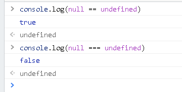

## 比较两个对象是否相等

- 在js中是无法使用 == 来比较两个对象的，比较的是两个对象的**地址**。
- 我们一般定义如果对象的各个属性值相等，那么两个对象就是相等的。如：{} 与 {} 相等

算法描述：

1. 假定有两个**对象** a 和 b
2. 遍历 a 中的成员，判断每一个 a 中的成员是否都在 b 中，并且与 b 中的对应成员值相等。
3. 遍历 b 中的成员，判断每一个 b 中的成员是否都在 a 中，并且与 a 中的对应成员值相等。
4. 如果成员是引用类型，递归
5. 如果 a 和 b 是 Date 类型，时间戳是一样的，即 a.getTime() === b.getTime()
6. 函数类型、正则表达式则可toString后再判断是否相等

在数学中就是判断两个集合相等：若 A包含于B 同时 B包含于A ，则称A与B相等，记为A=B

详见Vue源码中shared > until.js中的 **looseEqual** 函数，用于比较俩个值是否大致相等。

## 让函数只能调用一次

```js
function once(func) {
  let called = false  // 是否调用过
  return function () {
    if (!called) {
      called = true
      func.apply(this, arguments)
    }
  }
}
```

## 删除数组中任意一个元素

```js
function remove(arr, item) {
  if (arr.length) {
    const index = arr.indexOf(item)
    if (index > -1) {
      return arr.splice(index, 1)
    }
  }
}
```

## 数组去重

1. 一般做法：遍历原数组，判断新数组里是否存在这个值，如果不存在就把值push进新数组。

   ```js
   let arr = [1,1,1,2,2,2,3,3,3]
   let newArr = []
   arr.forEach(value => newArr.indexOf(v) === -1 && newArr.push(v)) 
   ```

2. ES6 Set。

   ```js
   let arr = [1,1,1,2,2,2,3,3,3]
   let newArr = [...new Set(arr)]
   ```

3. 利用对象键的唯一性实现去重。

   ```js
   let arr = [1,1,1,2,2,2,3,3,3]
   let _set = {}
   let newArr = []
   arr.forEach(v => _set[v] || (_set[v]=true, newArr.push(v)))
   ```

4. ...

