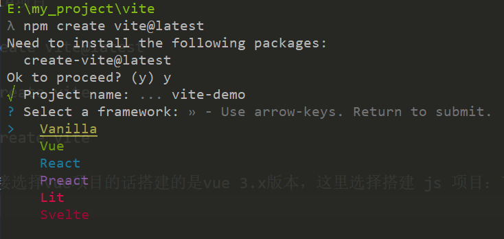
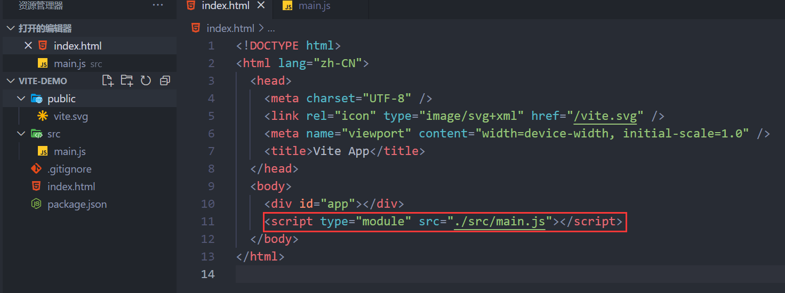
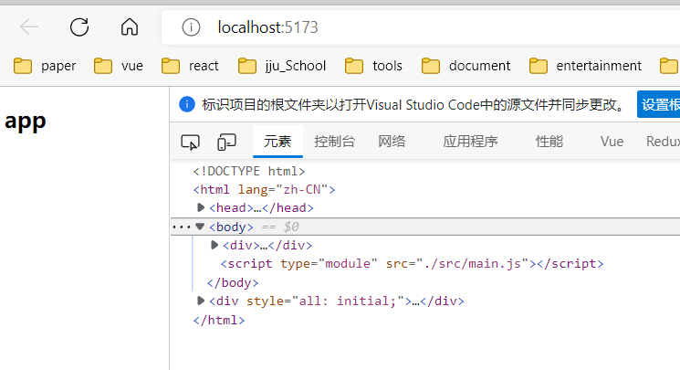
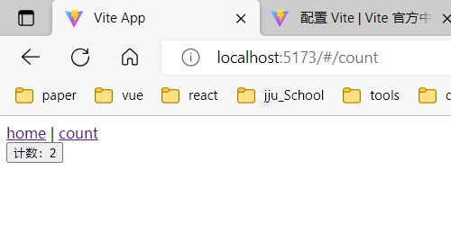

::: tip
<div>
  <h1>
    <span style="background:linear-gradient( 120deg, #bd34fe 30%, #41d1ff );-webkit-background-clip: text;-webkit-text-fill-color: transparent;">Vite</span>
  </h1>
  <h3>下一代的前端工具链</h3>
</div>

:::

<!-- more -->

[官方文档](https://cn.vitejs.dev/)

## 开始
- 搭建vite项目
```sh
npm create vite@latest
# or
yarn create vite
# or
pnpm create vite
```
- 由于直接选择vue项目的话搭建的是vue 3.x版本，这里选择搭建 js 项目：`Vanilla`，语言选择 JavaScript。


> 默认`index.html`在根目录

- 删除不必要的文件，修改main.js的引入位置。


- vite与vue2搭配使用，主要使用到的插件为`vite-plugin-vue2`，这也是vite文档中推荐适配vue2开发的插件。
```sh
# 安装vue
npm i vue@2.6.14

# 安装插件
npm i vite-plugin-vue2 -D

# 模板编译要和vue版本匹配
npm i vue-template-compiler@2.6.14 -D
```
## vite配置
- 根目录新建 `vite.config.js`，为了方便后续基于（dev/serve 或 build）命令或者不同的 模式 来决定选项，使用导出一个函数。
```js
import { defineConfig } from 'vite'
import { createVuePlugin } from 'vite-plugin-vue2'

export default defineConfig(({ command, mode }) => {
  // command === 'serve' | 'build'
  // mode === 'development' | 'production'

  return {
    plugins: [
      createVuePlugin()
    ],
    server: {
      open: true,
      host: true
    }
  }
})
```
## vue配置
- 创建 `App.vue`
```vue
<template>
  <div>
    <h2>app</h2>
  </div>
</template>
```
- 修改`main.js`文件
```js
import Vue from 'vue'
import App from './App.vue'

new Vue({
  el: '#app',
  render: h => h(App)
})
```
## 启动
```sh
npm run dev
```
> vite默认端口 5173

- 浏览器打开访问[http://localhost:5173/](http://localhost:5173/)，可以看到vue项目已经跑起来了。


## 引入 vue-router 和 vuex
:::tip
由于现在默认安装会安装 vue-router 4.x 和 vuex 4.x 和vue 3匹配的版本，我们搭建的是vue 2项目，所以在安装的时候需要指定一下版本号为 3.x 。
:::
```sh
npm i vuex@3.6.2 vue-router@3.6.5
```
- 新建`/src/router/index.js`，以及两个单文件组件`Home.vue`、`Count.vue`
```js
import Vue from "vue"
import VueRouter from "vue-router"

Vue.use(VueRouter)

const router = new VueRouter({
  routes: [
    {
      path: '/',
      name: 'home',
      component: () => import('../view/Home.vue')
    },
    {
      path: '/count',
      name: 'home',
      component: () => import('../view/Count.vue')
    }
  ]
})

export default router
```
- 修改`App.vue`
```vue
<template>
  <div>
    <router-link to="/">home</router-link> |
    <router-link to="/count">count</router-link>

    <router-view />
  </div>
</template>
```
- 新建`/src/store/index.js`
```js
import Vue from "vue"
import Vuex from "vuex"

Vue.use(Vuex)

export default new Vuex.Store({
  state: {
    count: 0
  },
  mutations: {
    increment(state) {
      state.count++
    }
  },
})
```
- `Count.vue`
```vue
<template>
  <div>
    <button @click="increment">计数：{{ count }}</button>
  </div>
</template>

<script>
  import { mapState, mapMutations } from 'vuex';
  export default {
    computed: {
      ...mapState({ count: 'count' })
    },
    methods: {
      ...mapMutations(['increment'])
    }
  }
</script>
```
- 修改`main.js`，引入router和store
```js {3,4,8,9}
import Vue from 'vue'
import App from './App.vue'
import router from './router'
import store from './store'

new Vue({
  el: '#app',
  router,
  store,
  render: h => h(App)
})
```

- 查看页面路由可以切换，以及点击button可以计数，即表示vuex和vue-router引入成功


## 引入element-ui
- element-ui安装使也指定下版本
```sh
npm i element-ui@2.15.6
```
- 修改`main.js`，作为插件引入element-ui
```js{5-6,8}
import Vue from 'vue'
import App from './App.vue'
import router from './router'
import store from './store'
import ElementUI from 'element-ui'
import 'element-ui/lib/theme-chalk/index.css'

Vue.use(ElementUI)

new Vue({
  el: '#app',
  router,
  store,
  render: h => h(App)
})
```
- 至此 vue 2 环境搭建完毕