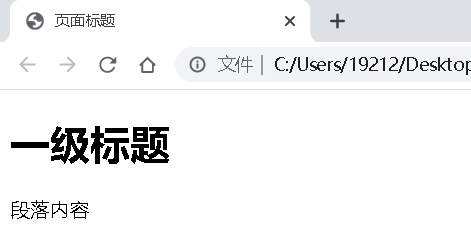
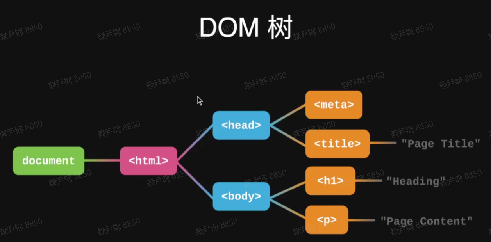
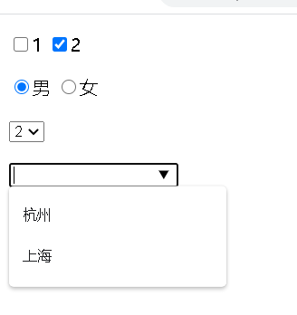
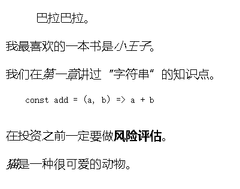
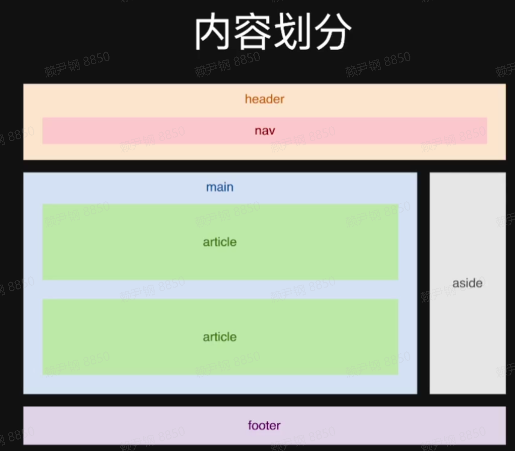

## HTML

- 超文本标记语言：**HyperText Markup Language**

  - 超文本：包含图片、标题、链接、表格等等

  - 标记语言：使用首尾对应的标签对表示内容结构。如 `<h1>一级标题</h1>`

  - 标签内定义属性，标签内无内容可简写

    

### HTML 概述

```html
<!DOCTYPE html>
<html lang="en">
  <head>
    <meta charset="UTF-8" />
    <title>页面标题</title>
  </head>
  <body>
    <h1>一级标题</h1>
    <p>段落内容</p>
  </body>
</html>
```

运行效果



浏览器将 HTML 代码转化为树形结构的 DOM 树



### HTML 语法

- 标签和属性不区分大小写，推荐**小写**
- 空标签可以不闭合，如`input`、`meta`
- 属性值推荐用**双引号**包裹
- 某些属性值默认为`true`可以省略，如`required`、`readonly`

### 标签

#### 标题

- h1 ~ h6，一级标题到六级标题。

#### 列表

- 有序列表：

  ```html
  <ol>
    <li>第1项</li>
    <li>第2项</li>
    <li>第3项</li>
  </ol>
  ```

- 无序列表：

  ```html
  <ul>
    <li>苹果</li>
    <li>香蕉</li>
    <li>西瓜</li>
  </ul>
  ```

- 定义列表：采用 key-value 形式描述数据，dt：描述的标题，dd：描述

  ```html
  <dl>
    <dt>姓名：</dt>
    <dd>张三</dd>
    <dt>爱好</dt>
    <dd>吃饭</dd>
    <dd>睡觉</dd>
    <dd>打豆豆</dd>
  </dl>
  ```

  

#### 链接

- a 标签：链接跳转`<a href="https://www.baidu.com" target="_blank">百度</a>`，\_blank 表示新窗口打开页面

#### 多媒体标签

- 图片：``，alt 属性表示图片加载失败显示的文字。
- 音频：`<audio src="/assets/music.ogg" />`
- 视频：`<video src="/assets/video.mp4" />`

#### 输入

- input：

  ```html
  <input placeholder="请输入用户名" />
  <input type="range" />
  <input type="number" min="1" max="10" />
  <input type="date" min="2020-1-1" />
  <textarea>hey</textarea>
  ```

  

```html
<p>
  <label><input type="checkbox" />1</label>
  <label><input type="checkbox" checked />2</label>
</p>
<p>
  <label><input type="radio" name="sex" checked />男</label>
  <label><input type="radio" name="sex" />女</label>
</p>
<p>
  <select>
    <option>1</option>
    <option selected>2</option>
    <option>3</option>
  </select>
</p>

<input list="citys" />
<!-- 提供输入提示 -->
<datalist id="citys">
  <option>杭州</option>
  <option>上海</option>
</datalist>
```



#### 文本类标签

##### 块级引用：

- blockquote：引用一段话，长内容

##### 短引用：

- cite：引用书名、章节等
- q：引用短的具体内容

##### code：表示代码，内容会用等宽字体展示

##### pre：保留文本格式

##### 表示强调

- strong：表示含义很重要、紧急，内容会加黑加粗显示
- em：表示某个内容要注意，内容会用斜体显示

```html
<blockquote cite="http://www.baidu.com">
  <p>巴拉巴拉。</p>
</blockquote>

<p>我最喜欢的一本书是<cite>小王子</cite>。</p>

<p>我们在<cite>第一章</cite>讲过<q>字符串</q>的知识点。</p>

<pre>
<code>const add = (a, b) => a + b</code>
</pre>

<p>在投资之前一定要做<strong>风险评估</strong>。</p>
<p><em>猫</em>是一种很可爱的动物。</p>
```



### 页面结构

- 常见的页面内容划分

  

  - header：页头，放 logo、导航等
  - main：页面主要内容
    - article：文章内容
  - aside：跟页面内容相关的，但不属于页面内容
  - footer：页尾，放参考链接、版权等

## HTML 语义化

- HTML 中元素、属性、及属性值都有某些含义。
- 开发者应该遵循语义来编写 HTML
  - **有序**列表就用**ol**，**无序**列表用**ul**
  - **lang**属性表示内容所属的语言

### 为什么要语义化？

#### 使用人群

- 开发者：修改、维护页面
- 浏览器：展示页面
- 搜索引擎：提取关键词、建立索引、排序
- 屏幕阅读器：给盲人读页面**内容**

#### 语义化的好处

- 代码可读性
- 可维护性
- 搜索引擎优化
- 提升无障碍性

#### HTML 传达内容，而不是传达样式

- `<p style="font-size:20px">我是一段话</p>`

### 如何做到语义化

- 了解每个标签的属性和含义，查看 W3C 规范，[MDN 文档]([学习 Web 开发 | MDN (mozilla.org)](https://developer.mozilla.org/zh-CN/docs/learn))
- 思考什么标签最适合描述这个内容
- 不使用可视化工具生成代码
